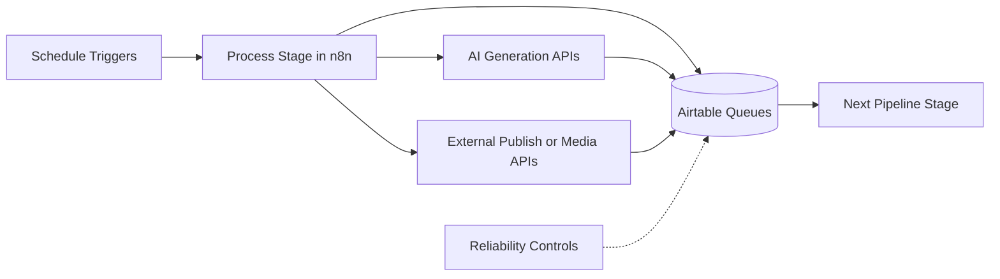

# High-Level Architecture (Public)

```mermaid
flowchart LR
  T[Schedule Triggers] --> P[Process Stage in n8n]
  P --> AI[AI Generation APIs]
  P --> EXT[External Publish or Media APIs]
  P --> AT[(Airtable Queues)]
  AI --> AT
  EXT --> AT
  AT --> NEXT[Next Pipeline Stage]
  R[Reliability Controls] -.-> AT
```

This diagram is intentionally abstract. It is not an implementable export.
