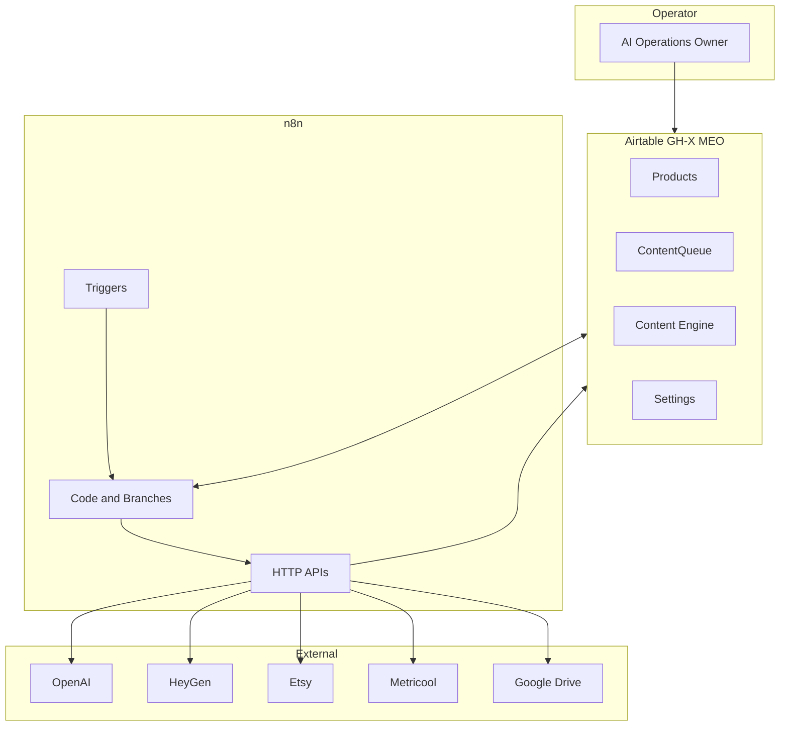

# Architecture Diagram — GH-X Content & Product Automation System

```mermaid
flowchart TB
  subgraph People[Operator]
    O[AI Operations Owner]
  end
  subgraph Data[Airtable GH-X MEO]
    P[Products]
    CQ[ContentQueue]
    CE[Content Engine]
    S[Settings]
  end
  subgraph Orch[n8n]
    T[Triggers]
    N[Code and Branches]
    H[HTTP APIs]
  end
  subgraph Ext[External]
    AI[OpenAI]
    HG[HeyGen]
    ET[Etsy]
    MC[Metricool]
    GD[Google Drive]
  end
  O --> Data
  T --> N --> H
  Data <--> N
  H --> AI & HG & ET & MC & GD
  H --> Data
```

Abstracted for public safety. Detailed private diagrams may exist in Private Master / prior evidence folders.
