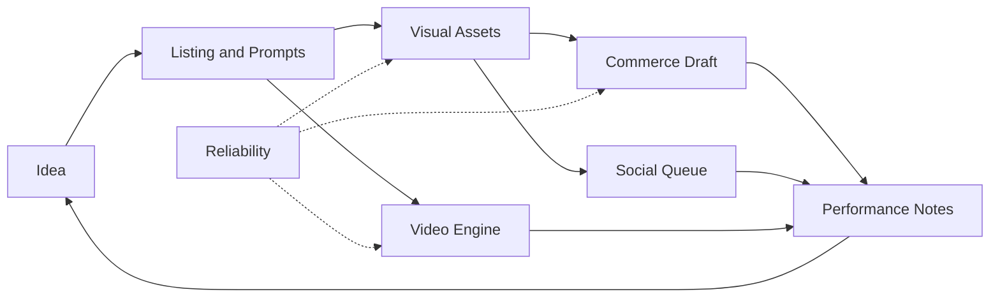

# Workflow Diagram — GH-X Content & Product Automation System

```mermaid
flowchart LR
  A[Idea] --> B[Listing and Prompts]
  B --> C[Visual Assets]
  C --> D[Commerce Draft]
  C --> E[Social Queue]
  B --> F[Video Engine]
  D --> G[Performance Notes]
  E --> G
  F --> G
  G --> A
  R[Reliability] -.-> C
  R -.-> D
  R -.-> F
```
