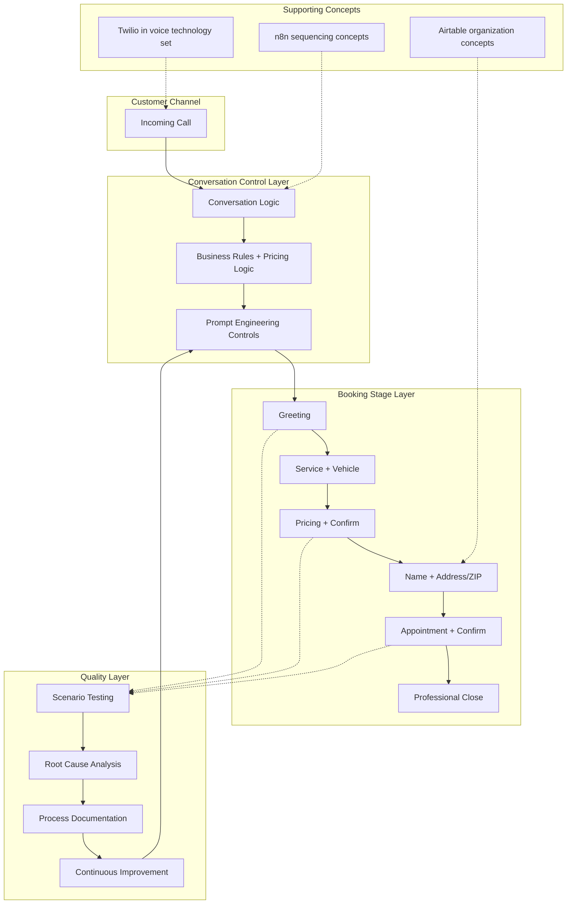

# AI Voice Booking Assistant — Architecture Diagram

## Architecture Overview
The assistant is treated as an operational workflow with process control, prompt control, optional no-code support concepts, and a quality loop.

## Layer Descriptions
| Layer | Responsibility |
|-------|----------------|
| Conversation Control | Logic, business rules, pricing rules, prompts |
| Booking Stages | Ordered customer information collection and confirmations |
| Supporting Concepts | n8n / Airtable / Twilio at documented scope only |
| Quality | Test → classify → fix → retest → document |

## Scope Note
Architecture reflects design/testing documentation. Supporting tools are shown at concept/technology-set depth already recorded in this portfolio.
