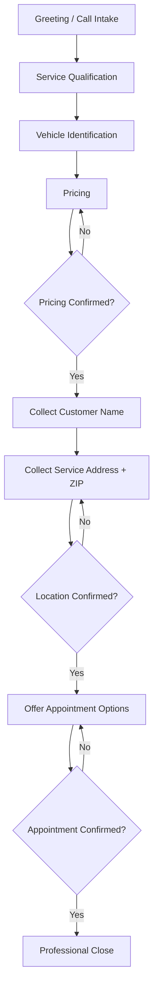

# AI Voice Assistant — Workflow Design

## Workflow Summary
The AI voice booking assistant guides customers through a controlled conversation from greeting to appointment confirmation. Each stage has defined inputs, outputs, and confirmation requirements before the assistant moves forward.

## Workflow Diagram (Markdown)

**Design rule already documented in this project:** pricing must be confirmed before customer data collection continues; address and ZIP are collected with explicit confirmation before appointment options.

## Step-by-Step Process
1. **Greeting / call intake** — Answer the call and begin the booking flow
2. **Service qualification** — Determine requested detailing services
3. **Vehicle identification** — Identify the customer's vehicle
4. **Pricing** — Calculate pricing based on service and vehicle details
5. **Pricing confirmation** — Confirm pricing before continuing
6. **Customer name** — Collect the customer's name
7. **Service address + ZIP** — Collect and confirm service location details
8. **Appointment options** — Offer available appointment times
9. **Appointment confirmation** — Confirm the selected appointment
10. **Professional close** — End the call clearly and professionally

## Inputs
- Customer responses at each stage
- Service selection details
- Vehicle information
- Pricing rules
- Address and ZIP code details
- Appointment availability options

## Outputs
- Qualified service request
- Confirmed pricing
- Complete customer and location details
- Confirmed appointment
- Documented test results and workflow improvements

## Tools & Integrations (Scope)
- **ChatGPT** — prompt design and refinement
- **n8n** — workflow / process sequencing concepts
- **Twilio** — included in the voice booking technology set; discussed only at the depth actually used
- **Airtable** — concepts for organizing booking-related process data

## Human-in-the-Loop Points
- Review of test failures and prompt refinements
- Documentation of issues and fixes
- Future handoff rules for cases requiring human follow-up (planned improvement)

## Design Controls
- One question at a time
- Stage boundaries with confirmation checkpoints
- Fixed booking order to prevent skipped steps
- Business rules that define when the assistant may advance

**Related:** [Business Problem](./Business_Problem.md) · [Prompt Engineering](./Prompt_Engineering.md) · [Testing and QA](./Testing_and_QA.md) · [Project Overview](./Project_Overview.md)
