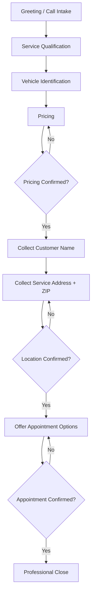

# AI Voice Booking Assistant — Workflow Diagram

## End-to-End Booking Workflow

## Design Controls (Documented)
- One question at a time
- Pricing confirmed before customer data collection continues
- Address and ZIP collected with explicit confirmation
- Fixed stage order to reduce skipped steps and incorrect booking order
- Anti-loop / anti-repeat prompt refinements after testing

## Related
- [Workflow_Design.md](./Workflow_Design.md)
- [Testing_and_QA.md](./Testing_and_QA.md)
- [Architecture_Diagram.md](./Architecture_Diagram.md)
