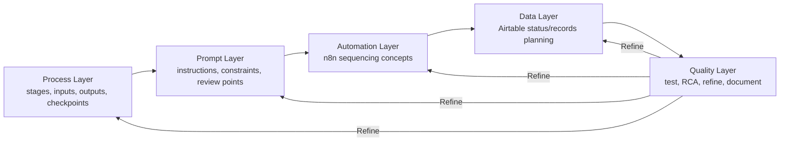
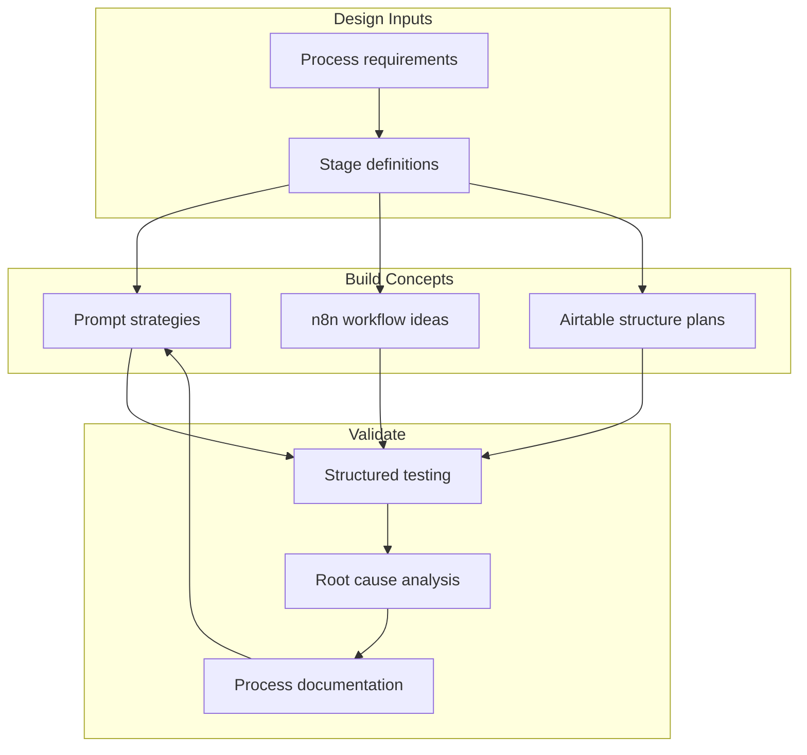

# GH-X — Architecture Diagram

## Layered Architecture

## Component View

## Scope Note
Architecture documents concept-level AI Operations design. Tools are used at design/test/documentation depth already recorded in this portfolio.
