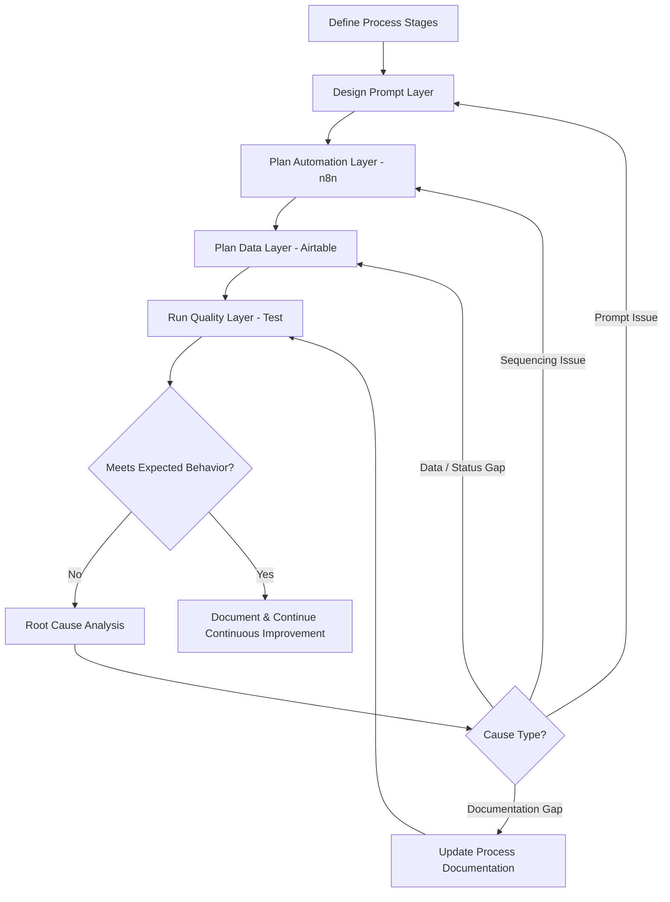
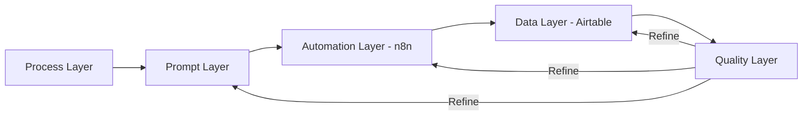

# GH-X — Workflow Design

## Workflow Summary
GH-X maps digital product operations into automation-ready stages with defined inputs, outputs, quality checkpoints, and handoffs. The design supports AI Operations process control by separating process logic, prompt instructions, automation sequencing, data tracking, and quality review.

## Workflow Diagram (Markdown)

## Layered Architecture Flow

## Step-by-Step Process
1. **Define process stages** — Identify workflow steps, required inputs, and expected outputs
2. **Design prompt layer** — Create stage-specific AI instructions, constraints, and review points
3. **Plan automation layer** — Sequence actions and handoffs in n8n workflow ideas
4. **Plan data layer** — Define Airtable tables, fields, and status tracking concepts
5. **Apply quality layer** — Test, classify failures, refine, and document

## Inputs
- Process requirements for each stage
- Required fields and status values
- Prompt instructions and constraints
- Test observations and failure notes

## Outputs
- Workflow architecture documentation
- Prompt strategy notes
- n8n workflow concepts
- Airtable structure plans
- QA and refinement records

## Tools & Integrations (Scope)
- **n8n** — workflow sequencing concepts
- **Airtable** — record/status planning
- **ChatGPT and Claude** — prompt prototyping and documentation

## Human-in-the-Loop Points
- Review of weak AI-assisted outputs
- Failure classification and root cause analysis
- Documentation updates after each refinement cycle
- Final acceptance of workflow changes after testing

## Design Controls
- Stage boundaries
- Expected output format per stage
- Review checkpoints before handoff
- Documented acceptance expectations
- Separation of prompt issues from sequencing issues

**Related:** [AI Automation](./AI_Automation.md) · [Prompt Engineering](./Prompt_Engineering.md) · [Testing and QA](./Testing_and_QA.md) · [Lessons Learned](./Lessons_Learned.md)
