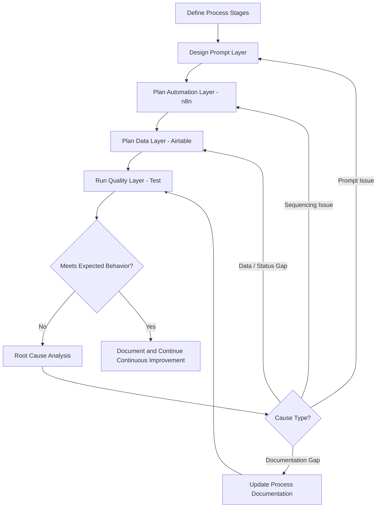
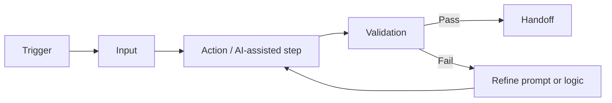

# GH-X — Workflow Diagram

## Design-to-Improvement Workflow

## Automation Logic Pattern (Per Stage)

## Related
- [Workflow_Design.md](./Workflow_Design.md)
- [AI_Automation.md](./AI_Automation.md)
- [Testing_and_QA.md](./Testing_and_QA.md)
