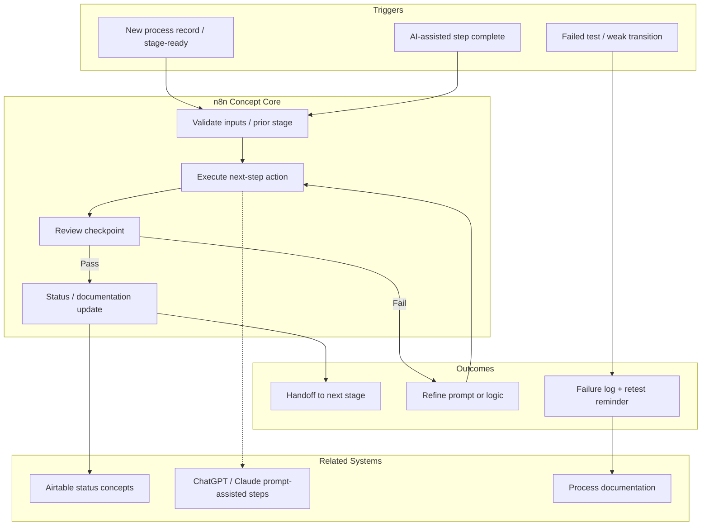

# n8n Workflow — Architecture Diagram

## Automation Architecture

## Template Architecture Map
| Template | Primary Path |
|----------|--------------|
| Stage Sequencing | Trigger → Validate → Action → Status → Review → Handoff |
| Prompt-Assisted Review | AI complete → Capture → Validate → Review branch → Continue/Refine |
| Failure Logging | Failure → Capture → Classify → Document → Retest reminder |

## Scope Note
Architecture reflects designed/tested workflow concepts supporting Voice Assistant and GH-X work.
