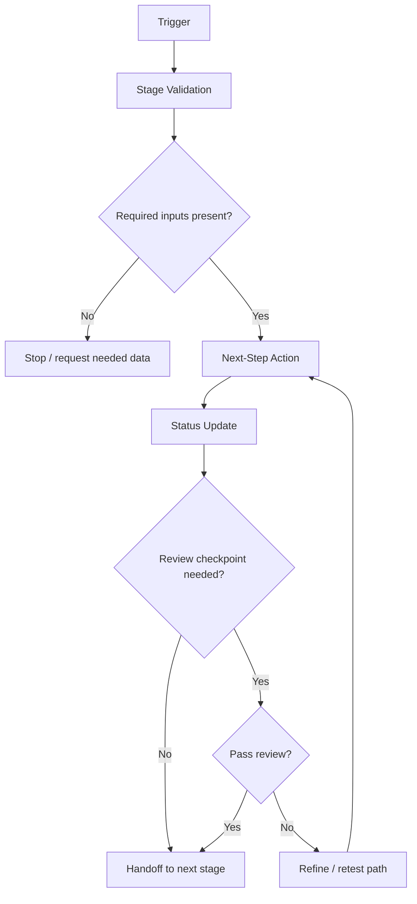
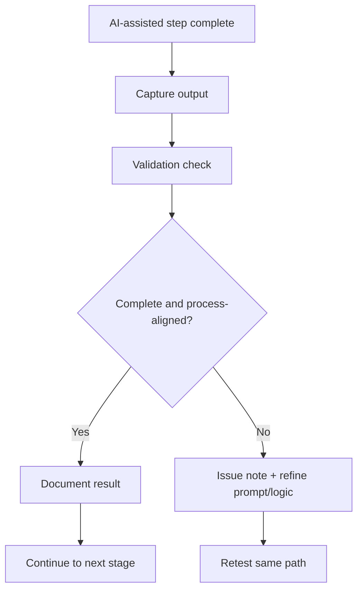
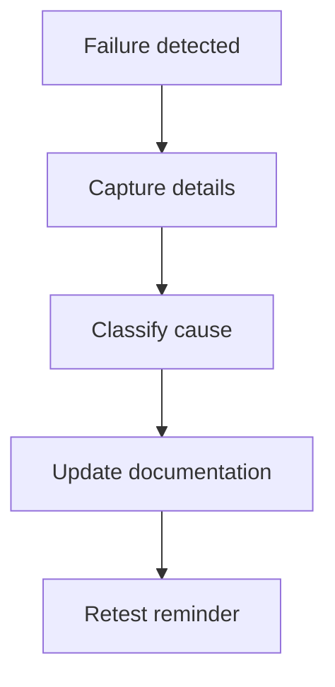

# n8n Workflow — Workflow Diagram

## Generic Stage Sequencing Flow

## Prompt-Assisted Review Flow

## Failure Logging Flow

## Related
- [Workflow_Templates.md](./Workflow_Templates.md)
- [Testing_and_QA.md](./Testing_and_QA.md)
- [Troubleshooting.md](./Troubleshooting.md)
