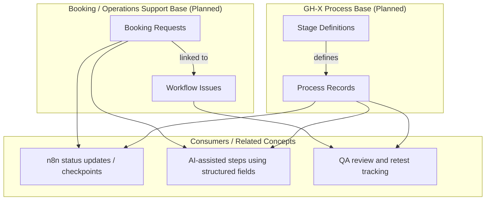
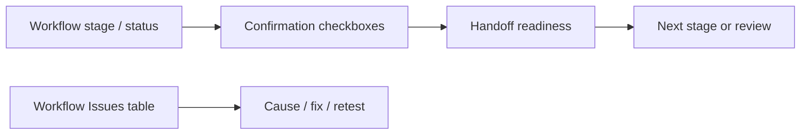

# Airtable — Architecture Diagram

## Data Architecture

```mermaid
flowchart TB
    subgraph BookingBase["Booking / Operations Support Base (Planned)"]
        BR[Booking Requests]
        WI[Workflow Issues]
        BR -->|linked to| WI
    end

    subgraph GHXBase["GH-X Process Base (Planned)"]
        SD[Stage Definitions]
        PR[Process Records]
        SD -->|defines| PR
    end

    subgraph Consumers["Consumers / Related Concepts"]
        N8N[n8n status updates / checkpoints]
        PROMPT[AI-assisted steps using structured fields]
        QA[QA review and retest tracking]
    end

    BR --> N8N
    PR --> N8N
    BR --> PROMPT
    PR --> PROMPT
    WI --> QA
    PR --> QA
```

## Field Control Pattern

```mermaid
flowchart LR
    STAGE[Workflow stage / status] --> CHECK[Confirmation checkboxes]
    CHECK --> READY[Handoff readiness]
    READY --> NEXT[Next stage or review]
    ISSUE[Workflow Issues table] --> RCA[Cause / fix / retest]
```

## Scope Note
Architecture reflects planned structures documented in Database_Structure.md.
