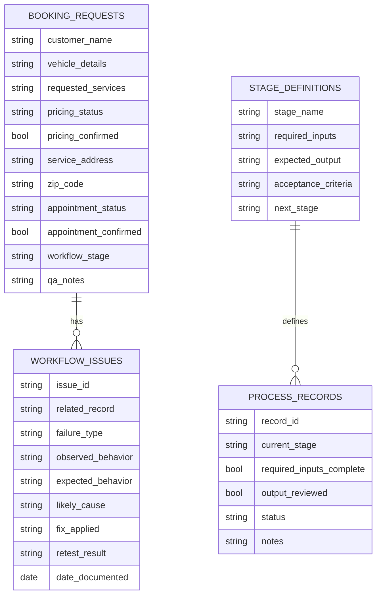

# Airtable — Database Structure

## Purpose
Document the database design for AI-assisted workflow tracking. Field and status design mirror real workflow stages so process progress is visible, testable, and reviewable.

## Data Model (Markdown Diagram)

---

## Base: Booking / Operations Support (Planned)
### Purpose
Support AI-assisted booking workflow organization and process review for Right Outside Auto Detailing LLC.

### Table 1 — Booking Requests
| Field | Type | Purpose |
|-------|------|---------|
| Customer name | Text | Collected during booking workflow |
| Vehicle details | Text | Service qualification input |
| Requested services | Text | Determines pricing and scope |
| Pricing status | Single select | Tracks pricing progress |
| Pricing confirmed | Checkbox | Confirmation checkpoint |
| Service address | Text | Mobile service location |
| ZIP code | Text | Location confirmation |
| Appointment status | Single select | Tracks scheduling progress |
| Appointment confirmed | Checkbox | Confirmation checkpoint |
| Workflow stage | Single select | Mirrors booking workflow stage |
| QA notes | Long text | Testing and review notes |

### Table 2 — Workflow Issues
| Field | Type | Purpose |
|-------|------|---------|
| Issue ID | Text / auto | Unique reference |
| Related booking/process record | Link | Ties issue to a record |
| Failure type | Single select | loop, repeat, order, address, pricing, etc. |
| Observed behavior | Long text | What happened |
| Expected behavior | Long text | What should happen |
| Likely cause | Single select | prompt, sequencing, data, documentation |
| Fix applied | Long text | Corrective action |
| Retest result | Single select | resolved / reduced / open |
| Date documented | Date | Traceability |

### Relationships
- Workflow Issues linked to Booking Requests

### Views / Filters
- By workflow stage
- Open QA issues
- Pricing confirmation pending
- Appointment confirmation pending

### Automations (Planned)
Planned integration with n8n workflow concepts for status updates and review checkpoints. See [Automation Planning](./Automation_Planning.md).

---

## Base: GH-X Process Tracking (Planned)
### Purpose
Track digital product workflow stages, AI-assisted step outputs, and review status.

### Table 1 — Process Records
| Field | Type | Purpose |
|-------|------|---------|
| Record name / ID | Text | Identify the process item |
| Current stage | Single select | Mirrors GH-X workflow stage |
| Required inputs complete | Checkbox | Readiness check |
| Output reviewed | Checkbox | QA checkpoint |
| Status | Single select | Overall state |
| Notes | Long text | Review notes |

### Table 2 — Stage Definitions
| Field | Type | Purpose |
|-------|------|---------|
| Stage name | Text | Workflow stage label |
| Required inputs | Long text | What must exist to start |
| Expected output | Long text | Definition of done |
| Acceptance criteria | Long text | Quality bar for the stage |
| Next stage | Text / link | Handoff target |

### Relationships
- Process Records reference Stage Definitions

## Design Notes
- Status fields mirror workflow stages exactly
- Checkboxes represent confirmation checkpoints
- Issue logging kept separate from primary process records
- Field purpose documented for ATS-friendly process documentation
- Acceptance criteria stored in Stage Definitions to support QA

## Privacy & Data Handling
- Remove customer PII from shared screenshots
- Do not publish live base links in employer materials unless approved
- Use sanitized examples in portfolio evidence

**Related:** [Airtable Overview](./Airtable_Overview.md) · [Automation Planning](./Automation_Planning.md) · [Testing and QA](./Testing_and_QA.md) · [GH-X Project](../04%20GH-X/Project_Overview.md)
