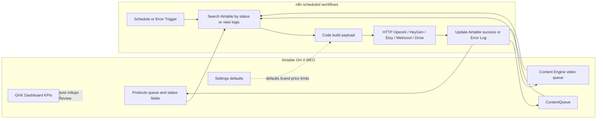

# Airtable ↔ n8n Workflow Diagram

## How it connects (definition-aligned)
1. **Products** holds the main product lifecycle states n8n searches/updates (Ready to Design, upload/publish fields, Error Log, asset URLs, Etsy IDs, social fields).
2. **ContentQueue** supports social scheduling packs (Ready for Metricool / Scheduled / Posted views).
3. **Content Engine** supports script → video_ready → Metricool views with HeyGen-oriented fields (`video_id`, `video_status`, `heygen_error`).
4. **Settings** supplies defaults (price, platforms, daily limits, brand voice) for generation workflows.
5. Native Airtable Automations were **not** used at inspection time — orchestration is external via n8n.

## Non-claims
This diagram reflects schema + known n8n definition patterns. It does **not** claim current successful execution volume.
