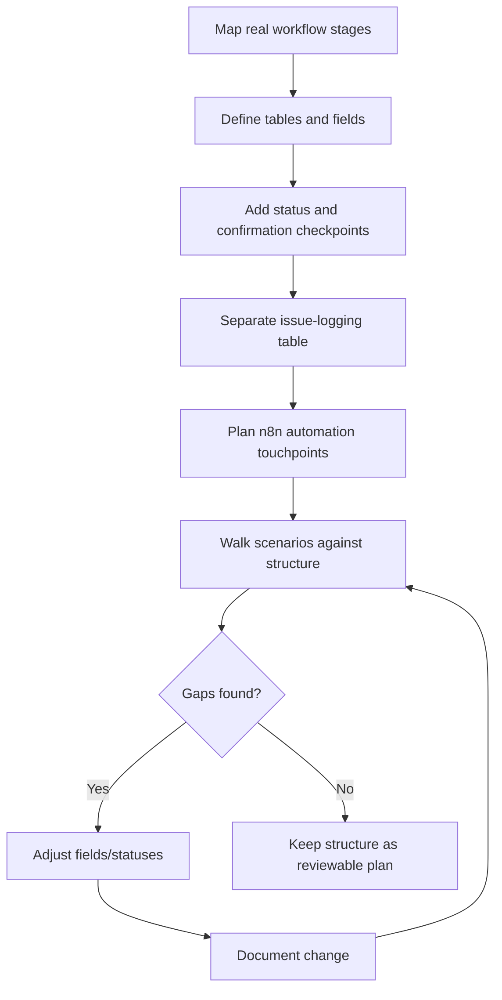
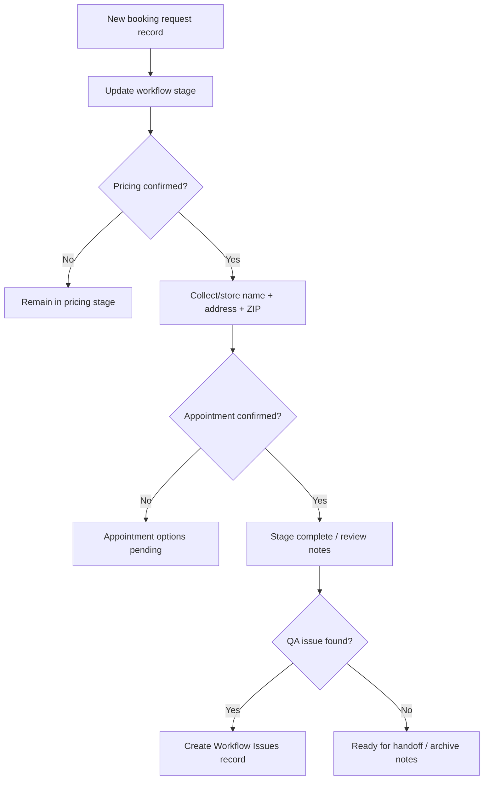

# Airtable — Workflow Diagram

## Structure Design and Validation Workflow

## Booking Record Lifecycle (Conceptual)

## Related
- [Database_Structure.md](./Database_Structure.md)
- [Automation_Planning.md](./Automation_Planning.md)
- [Testing_and_QA.md](./Testing_and_QA.md)
