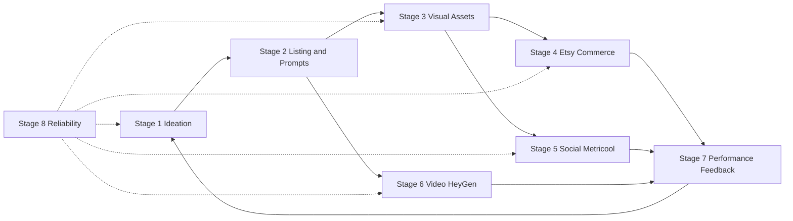

# Case Study — GH-X Digital Product Automation System

**Type:** Multi-workflow AI Operations system (definition-based)  
**Workflows included:** 23 unique n8n exports  
**Source of truth:** Desktop `GH-X/workflows/*.json`  
**Execution evidence:** Not found in local n8n DB  
**Export active flags:** `false`  
**Overall status:** Functional Build · **Not Production Ready**

## Recruiter summary
GH-X is an end-to-end **digital product operations automation system** designed in n8n and coordinated through Airtable queues. Exported workflows cover ideation, listing/prompt generation, image and product-file creation, Etsy draft publishing, Metricool social scheduling, HeyGen video generation/polling, performance feedback, and reliability/alerting.

This case study treats those workflows as **one system**, not many disconnected mini-projects.

## Business problem
Manual digital-product operations (ideas → assets → listings → social/video → measurement) are inconsistent and hard to QA. GH-X models that pipeline as scheduled, queue-driven automations with success/error writebacks.

## Intended outcome (design intent — not a measured KPI)
A repeatable Airtable-centered pipeline where each stage reads queue rows, performs transforms/API calls, and writes status back for the next stage.

## System architecture (definition-level)

## Shared platform components
| Layer | Evidence in definitions |
|-------|-------------------------|
| Orchestration | n8n Schedule / Error triggers, Code, IF/Switch, Split In Batches |
| Data / queues | Airtable search/create/update across nearly all workflows |
| AI generation | OpenAI Chat Completions and Images via HTTP |
| Video | HeyGen create + status poll via HTTP |
| Commerce | Etsy draft create + asset upload via HTTP |
| Social | Metricool schedule via HTTP |
| Storage | Google Drive nodes in image/mockup flows |

**Services observed:** Airtable, Etsy API, Google Drive, HeyGen API, Metricool API, OpenAI API

## Pipeline stages
### Stage 1 — Ideation & Research
**Business problem:** Need a repeatable way to generate and recycle product/content ideas into a structured queue.

| Workflow | Nodes | Complexity | Status | Key services |
|----------|------:|------------|--------|--------------|
| [GHX-01-Idea-Intelligence](../../03%20n8n%20Workflows/Project-A_Idea_Intelligence/GHX-01-Idea-Intelligence/README.md) | 5 | Beginner | Functional Build | Airtable, OpenAI API |
| [GHX-11-Winning-Idea-Loop](../../03%20n8n%20Workflows/Project-A_Idea_Intelligence/GHX-11-Winning-Idea-Loop/README.md) | 9 | Intermediate | Functional Build | Airtable, OpenAI API |
| [GHX-12-Content-Idea-Generator](../../03%20n8n%20Workflows/Project-A_Idea_Intelligence/GHX-12-Content-Idea-Generator/README.md) | 12 | Intermediate | Functional Build | Airtable, OpenAI API |
### Stage 2 — Listing Copy & Prompt Generation
**Business problem:** Ideas must become structured listing copy and design/reel prompts before assets are produced.

| Workflow | Nodes | Complexity | Status | Key services |
|----------|------:|------------|--------|--------------|
| [GHX-Generate-Product-Listing](../../03%20n8n%20Workflows/Project-B_Listing_and_Prompt_Generation/GHX-Generate-Product-Listing/README.md) | 10 | Intermediate | Functional Build | Airtable, OpenAI API |
| [Design + Reel Prompt Generator](../../03%20n8n%20Workflows/Project-B_Listing_and_Prompt_Generation/Design-Reel-Prompt-Generator/README.md) | 6 | Intermediate | Functional Build | Airtable |
### Stage 3 — Visual Asset & Product File Generation
**Business problem:** Queued products need images, mockups, social creatives, and product files without fully manual production.

| Workflow | Nodes | Complexity | Status | Key services |
|----------|------:|------------|--------|--------------|
| [GH-X OpenAI Image Generator](../../03%20n8n%20Workflows/Project-C_Visual_Asset_Generation/GH-X-OpenAI-Image-Generator/README.md) | 10 | Intermediate | Functional Build | Airtable, Google Drive, OpenAI API |
| [GHX-04-Mockup-Generator](../../03%20n8n%20Workflows/Project-C_Visual_Asset_Generation/GHX-04-Mockup-Generator/README.md) | 15 | Advanced | Functional Build | Airtable, Google Drive, OpenAI API |
| [GHX-05-Social-Asset-Generator](../../03%20n8n%20Workflows/Project-C_Visual_Asset_Generation/GHX-05-Social-Asset-Generator/README.md) | 10 | Intermediate | Functional Build | Airtable, OpenAI API |
| [GHX-03B-Product-File-Uploader](../../03%20n8n%20Workflows/Project-C_Visual_Asset_Generation/GHX-03B-Product-File-Uploader/README.md) | 22 | Advanced | Functional Build | Airtable, Google Drive, OpenAI API |
### Stage 4 — Commerce Publish (Etsy)
**Business problem:** Publish-ready rows must be validated and turned into Etsy draft listings with uploaded assets.

| Workflow | Nodes | Complexity | Status | Key services |
|----------|------:|------------|--------|--------------|
| [GHX-06-Publish-Queue-Manager](../../03%20n8n%20Workflows/Project-D_Commerce_Publish_Etsy/GHX-06-Publish-Queue-Manager/README.md) | 8 | Intermediate | Functional Build | Airtable |
| [GHX-03-Etsy-Metricool-Handoff](../../03%20n8n%20Workflows/Project-D_Commerce_Publish_Etsy/GHX-03-Etsy-Metricool-Handoff/README.md) | 4 | Beginner | Functional Build | Airtable |
| [GHX-07-Etsy-Draft-Publisher](../../03%20n8n%20Workflows/Project-D_Commerce_Publish_Etsy/GHX-07-Etsy-Draft-Publisher/README.md) | 18 | Advanced | Functional Build | Airtable, Etsy API |
### Stage 5 — Social Scheduling (Metricool)
**Business problem:** Social content needs pack building, scheduling, and a ready-to-post queue tracked in Airtable.

| Workflow | Nodes | Complexity | Status | Key services |
|----------|------:|------------|--------|--------------|
| [GHX-08-Metricool-Scheduler](../../03%20n8n%20Workflows/Project-E_Social_Scheduling_Metricool/GHX-08-Metricool-Scheduler/README.md) | 16 | Advanced | Functional Build | Airtable, Metricool API, OpenAI API |
| [GHX-14-Metricool-Content-Scheduler](../../03%20n8n%20Workflows/Project-E_Social_Scheduling_Metricool/GHX-14-Metricool-Content-Scheduler/README.md) | 16 | Advanced | Functional Build | Airtable, Metricool API, OpenAI API |
| [GHX-09-Ready-To-Post-Queue](../../03%20n8n%20Workflows/Project-E_Social_Scheduling_Metricool/GHX-09-Ready-To-Post-Queue/README.md) | 11 | Intermediate | Functional Build | Airtable |
### Stage 6 — Video Pipeline (Script → HeyGen → QA)
**Business problem:** Video content requires script generation, async video creation, status polling, and a QA gate.

| Workflow | Nodes | Complexity | Status | Key services |
|----------|------:|------------|--------|--------------|
| [GHX-13-Video-Script-Builder](../../03%20n8n%20Workflows/Project-F_Video_Pipeline_HeyGen/GHX-13-Video-Script-Builder/README.md) | 10 | Intermediate | Functional Build | Airtable, OpenAI API |
| [GHX-16-HeyGen-Video-Generator](../../03%20n8n%20Workflows/Project-F_Video_Pipeline_HeyGen/GHX-16-HeyGen-Video-Generator/README.md) | 13 | Intermediate | Functional Build | Airtable, HeyGen API |
| [GHX-17-HeyGen-Status-Poller](../../03%20n8n%20Workflows/Project-F_Video_Pipeline_HeyGen/GHX-17-HeyGen-Status-Poller/README.md) | 14 | Intermediate | Functional Build | Airtable, HeyGen API |
| [GHX-15-Content-QA](../../03%20n8n%20Workflows/Project-F_Video_Pipeline_HeyGen/GHX-15-Content-QA/README.md) | 8 | Intermediate | Functional Build | Airtable |
### Stage 7 — Performance Feedback Loop
**Business problem:** Published/live products need metric notes written back so ideation can improve.

| Workflow | Nodes | Complexity | Status | Key services |
|----------|------:|------------|--------|--------------|
| [GHX-07-Performance-Tracker](../../03%20n8n%20Workflows/Project-G_Performance_Feedback/GHX-07-Performance-Tracker/README.md) | 8 | Intermediate | Functional Build | Airtable, OpenAI API |
| [GHX-10-Performance-Tracker](../../03%20n8n%20Workflows/Project-G_Performance_Feedback/GHX-10-Performance-Tracker/README.md) | 12 | Advanced | Functional Build | Airtable, Etsy API, OpenAI API |
### Stage 8 — Reliability, Alerts & Self-Healing
**Business problem:** Failures across the system need alerting and failed-row requeue / manual-review handling.

| Workflow | Nodes | Complexity | Status | Key services |
|----------|------:|------------|--------|--------------|
| [GHX-00-Error-Alerts](../../03%20n8n%20Workflows/Project-H_Reliability_and_Alerts/GHX-00-Error-Alerts/README.md) | 5 | Beginner | Functional Build | — |
| [GHX-09-Self-Healing-QA](../../03%20n8n%20Workflows/Project-H_Reliability_and_Alerts/GHX-09-Self-Healing-QA/README.md) | 11 | Intermediate | Functional Build | Airtable |

## Complexity
System-level: **Advanced**. Individual workflows range Beginner → Advanced.

## Status policy
| Label | Used? |
|-------|-------|
| Functional Build | Yes — for definition-complete workflows |
| Prototype | Local Master Automation stub only |
| Production Ready | **No** — no execution evidence |

## Evidence
See [Evidence_Checklist.md](./Evidence_Checklist.md) · [Workflow_Diagram.md](./Workflow_Diagram.md) · [Recruiter_Overview.md](./Recruiter_Overview.md)

## Related
- Per-workflow packs: [../../03 n8n Workflows](../../03%20n8n%20Workflows/README.md)
- Written docs: [../../../04 GH-X](../../../04%20GH-X/README.md)
