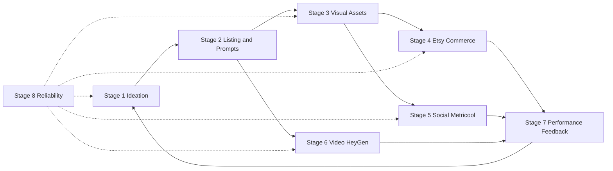

# GH-X System Workflow Diagram

```mermaid
flowchart LR
  S1[Stage 1 Ideation] --> S2[Stage 2 Listing and Prompts]
  S2 --> S3[Stage 3 Visual Assets]
  S3 --> S4[Stage 4 Etsy Commerce]
  S3 --> S5[Stage 5 Social Metricool]
  S2 --> S6[Stage 6 Video HeyGen]
  S4 --> S7[Stage 7 Performance Feedback]
  S5 --> S7
  S6 --> S7
  S7 --> S1
  R[Stage 8 Reliability] -.-> S1
  R -.-> S3
  R -.-> S4
  R -.-> S5
  R -.-> S6
```
