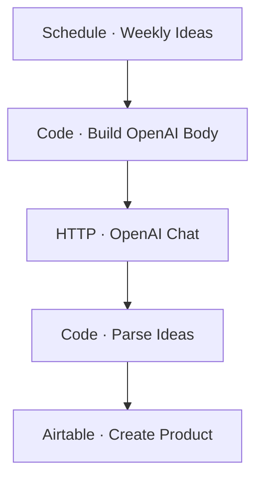

# Workflow Diagram — GHX-01-Idea-Intelligence

**Source:** `GHX-01-Idea-Intelligence.json` · **Status:** Functional Build · **Complexity:** Beginner  
**Execution evidence:** Not found — definition only.

