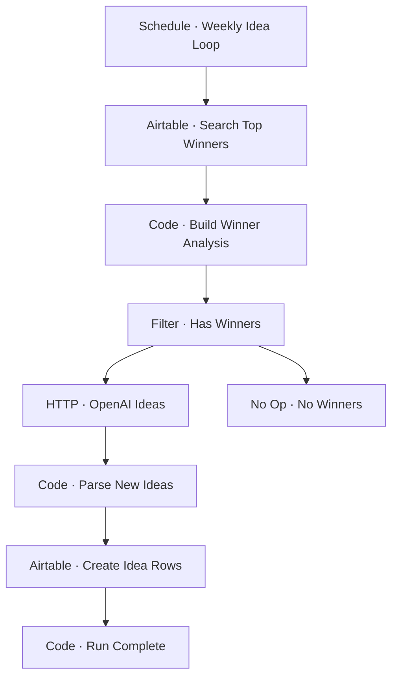

# Workflow Diagram — GHX-11-Winning-Idea-Loop

**Source:** `GHX-11-Winning-Idea-Loop.json` · **Status:** Functional Build · **Complexity:** Intermediate  
**Execution evidence:** Not found — definition only.

