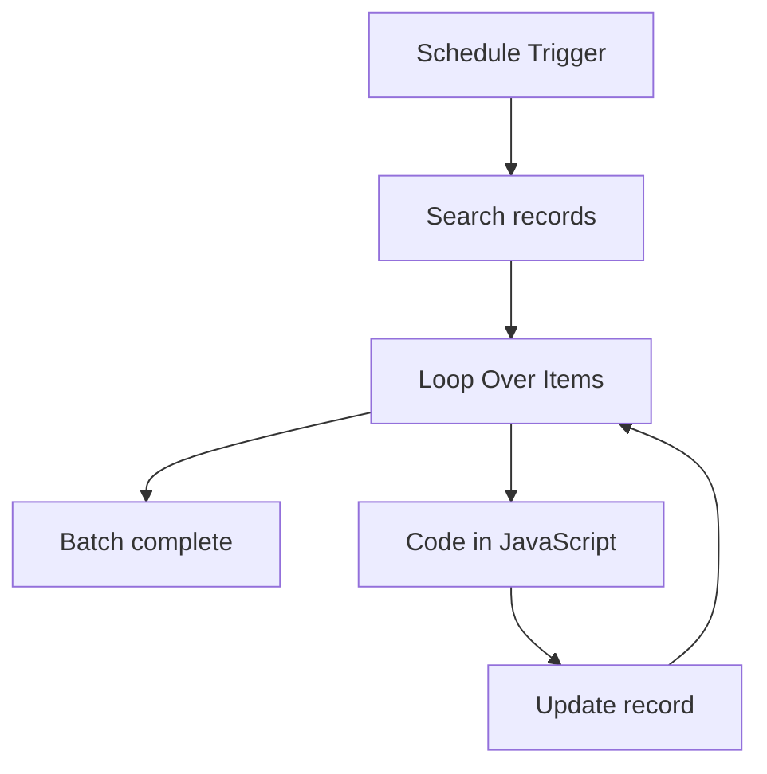

# Workflow Diagram — Design + Reel Prompt Generator

**Source:** `Design + Reel Prompt Generator.json` · **Status:** Functional Build · **Complexity:** Intermediate  
**Execution evidence:** Not found — definition only.

