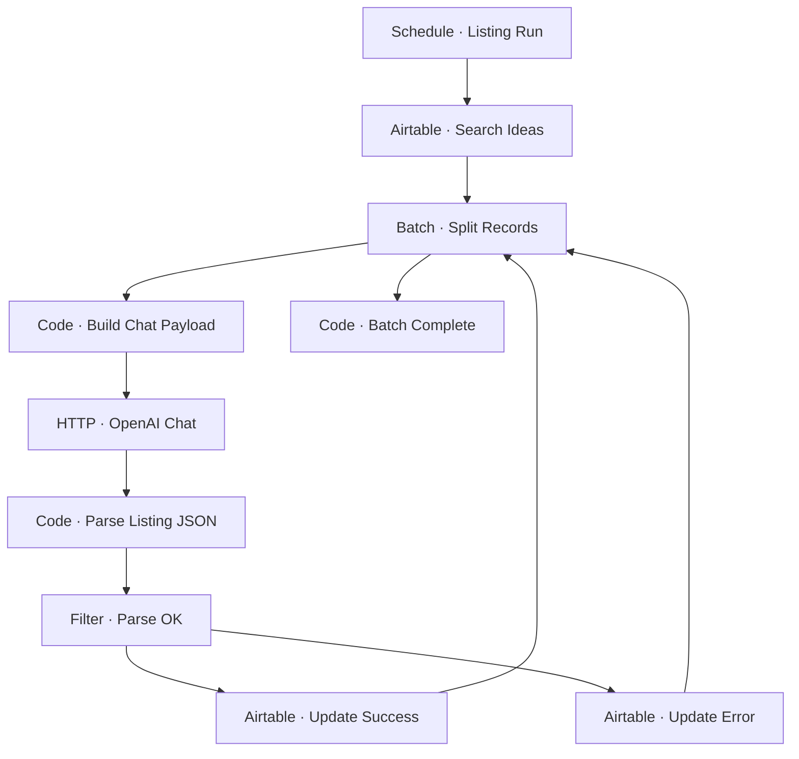

# Workflow Diagram — GHX-Generate-Product-Listing

**Source:** `GHX-Generate-Product-Listing.json` · **Status:** Functional Build · **Complexity:** Intermediate  
**Execution evidence:** Not found — definition only.

