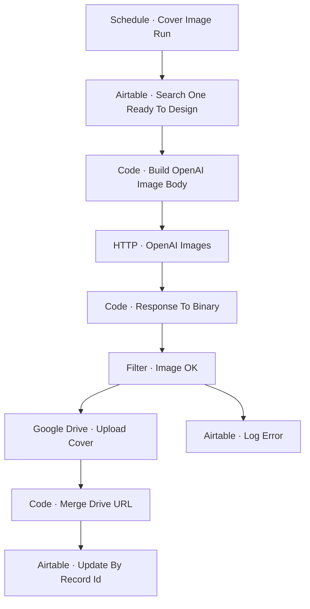

# Workflow Diagram — GH-X OpenAI Image Generator

**Source:** `GH-X OpenAI Image Generator.json` · **Status:** Functional Build · **Complexity:** Intermediate  
**Execution evidence:** Not found — definition only.

