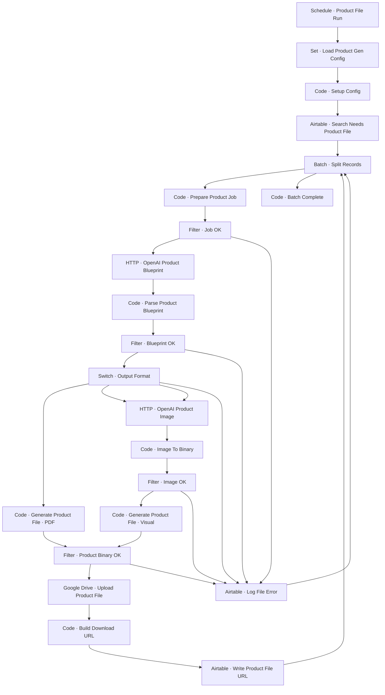

# Workflow Diagram — GHX-03B-Product-File-Uploader

**Source:** `GHX-03B-Product-File-Uploader.json` · **Status:** Functional Build · **Complexity:** Advanced  
**Execution evidence:** Not found — definition only.

