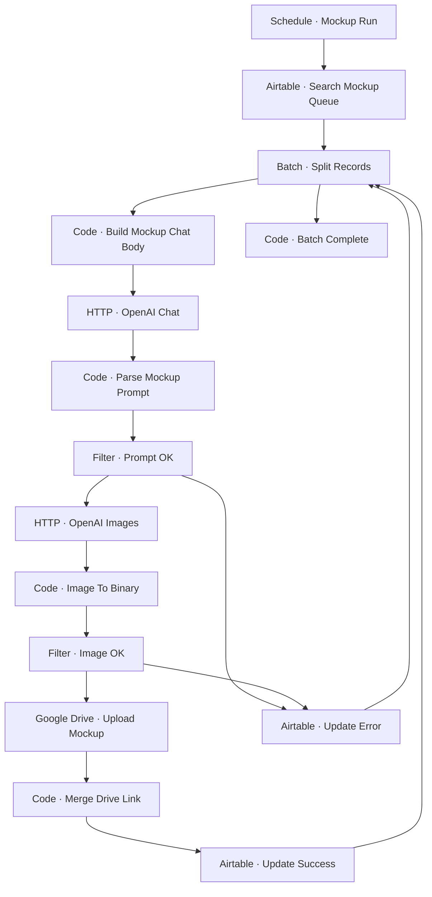

# Workflow Diagram — GHX-04-Mockup-Generator

**Source:** `GHX-04-Mockup-Generator.json` · **Status:** Functional Build · **Complexity:** Advanced  
**Execution evidence:** Not found — definition only.

