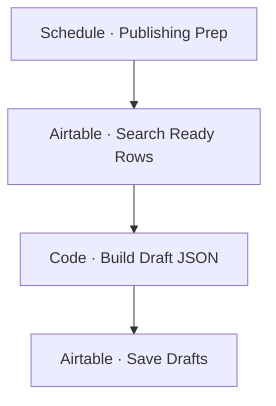

# Workflow Diagram — GHX-03-Etsy-Metricool-Handoff

**Source:** `GHX-03-Etsy-Metricool-Handoff.json` · **Status:** Functional Build · **Complexity:** Beginner  
**Execution evidence:** Not found — definition only.

