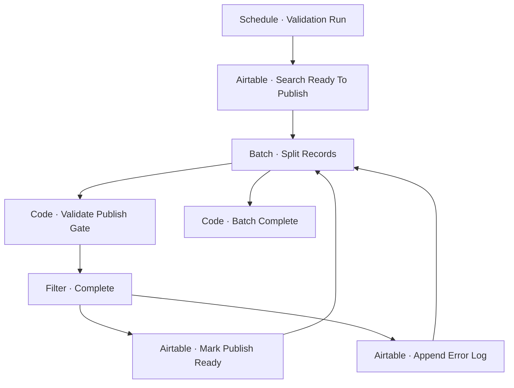

# Workflow Diagram — GHX-06-Publish-Queue-Manager

**Source:** `GHX-06-Publish-Queue-Manager.json` · **Status:** Functional Build · **Complexity:** Intermediate  
**Execution evidence:** Not found — definition only.

