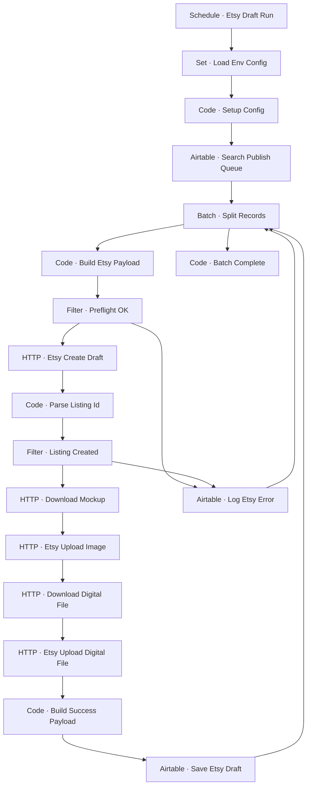

# Workflow Diagram — GHX-07-Etsy-Draft-Publisher

**Source:** `GHX-07-Etsy-Draft-Publisher.json` · **Status:** Functional Build · **Complexity:** Advanced  
**Execution evidence:** Not found — definition only.

