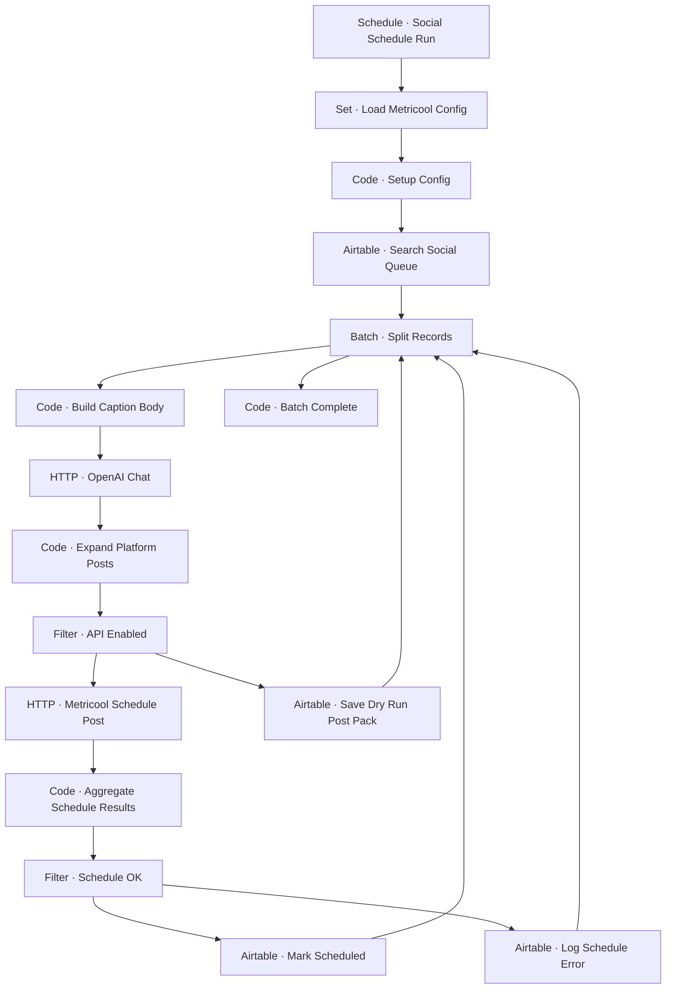

# Workflow Diagram — GHX-08-Metricool-Scheduler

**Source:** `GHX-08-Metricool-Scheduler.json` · **Status:** Functional Build · **Complexity:** Advanced  
**Execution evidence:** Not found — definition only.

