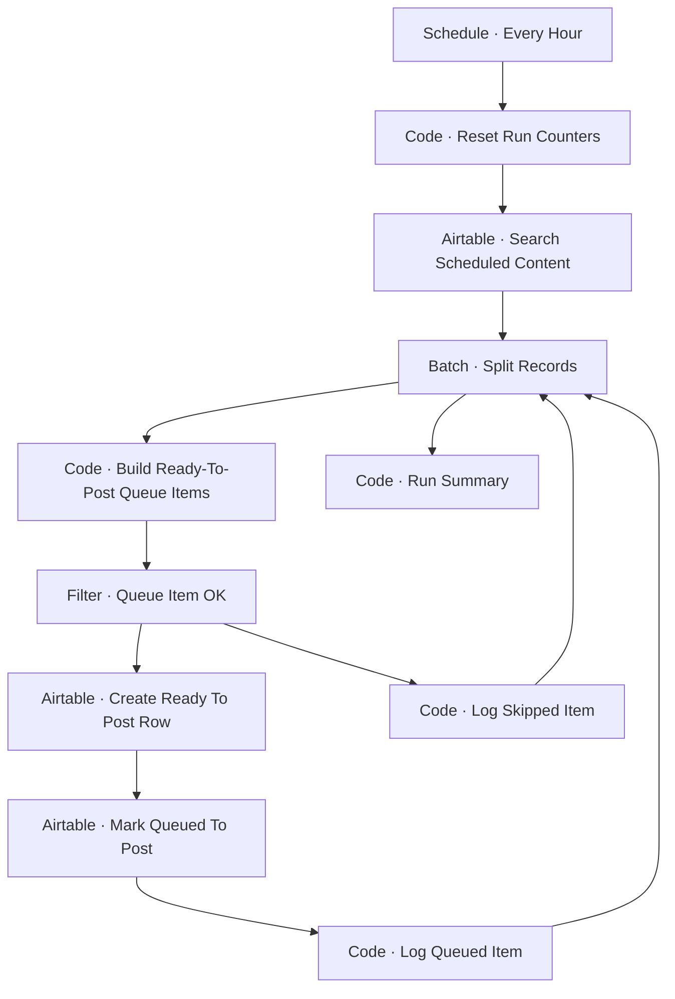

# Workflow Diagram — GHX-09-Ready-To-Post-Queue

**Source:** `GHX-09-Ready-To-Post-Queue.json` · **Status:** Functional Build · **Complexity:** Intermediate  
**Execution evidence:** Not found — definition only.

