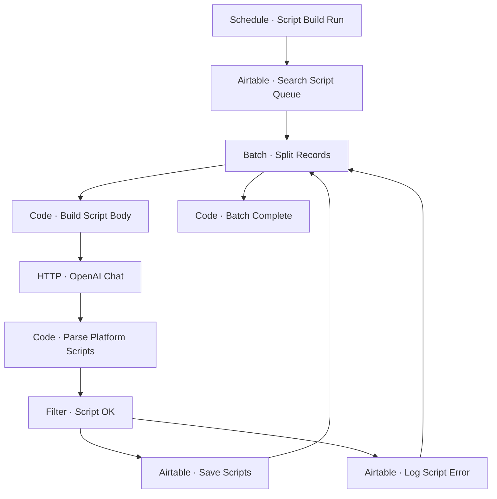

# Workflow Diagram — GHX-13-Video-Script-Builder

**Source:** `GHX-13-Video-Script-Builder.json` · **Status:** Functional Build · **Complexity:** Intermediate  
**Execution evidence:** Not found — definition only.

