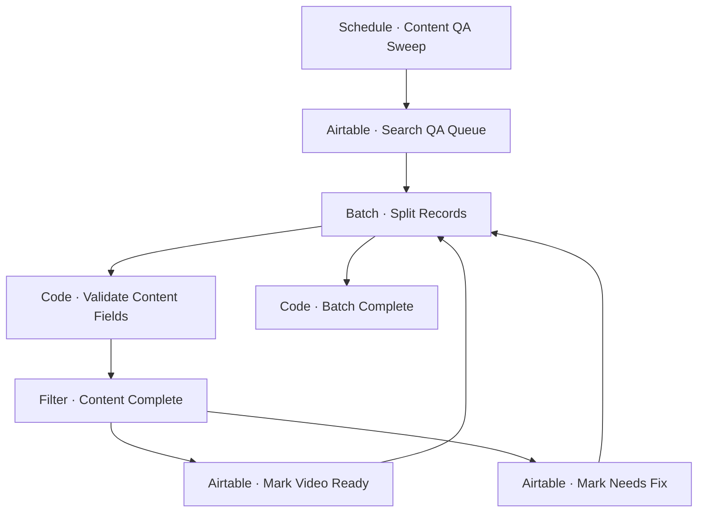

# Workflow Diagram — GHX-15-Content-QA

**Source:** `GHX-15-Content-QA.json` · **Status:** Functional Build · **Complexity:** Intermediate  
**Execution evidence:** Not found — definition only.

```mermaid
flowchart TD
  Schedule___Content_QA_Sweep["Schedule · Content QA Sweep"]
  Airtable___Search_QA_Queue["Airtable · Search QA Queue"]
  Batch___Split_Records["Batch · Split Records"]
  Code___Validate_Content_Fields["Code · Validate Content Fields"]
  Filter___Content_Complete["Filter · Content Complete"]
  Airtable___Mark_Video_Ready["Airtable · Mark Video Ready"]
  Airtable___Mark_Needs_Fix["Airtable · Mark Needs Fix"]
  Code___Batch_Complete["Code · Batch Complete"]
  Schedule___Content_QA_Sweep --> Airtable___Search_QA_Queue
  Airtable___Search_QA_Queue --> Batch___Split_Records
  Batch___Split_Records --> Code___Validate_Content_Fields
  Batch___Split_Records --> Code___Batch_Complete
  Code___Validate_Content_Fields --> Filter___Content_Complete
  Filter___Content_Complete --> Airtable___Mark_Video_Ready
  Filter___Content_Complete --> Airtable___Mark_Needs_Fix
  Airtable___Mark_Video_Ready --> Batch___Split_Records
  Airtable___Mark_Needs_Fix --> Batch___Split_Records
```
