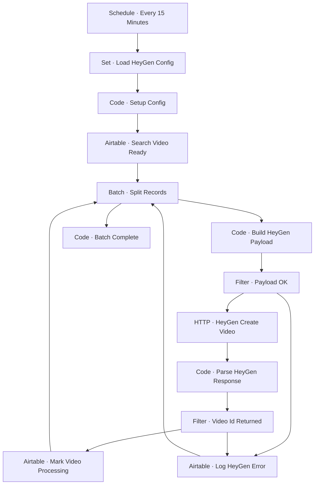

# Workflow Diagram — GHX-16-HeyGen-Video-Generator

**Source:** `GHX-16-HeyGen-Video-Generator.json` · **Status:** Functional Build · **Complexity:** Intermediate  
**Execution evidence:** Not found — definition only.

