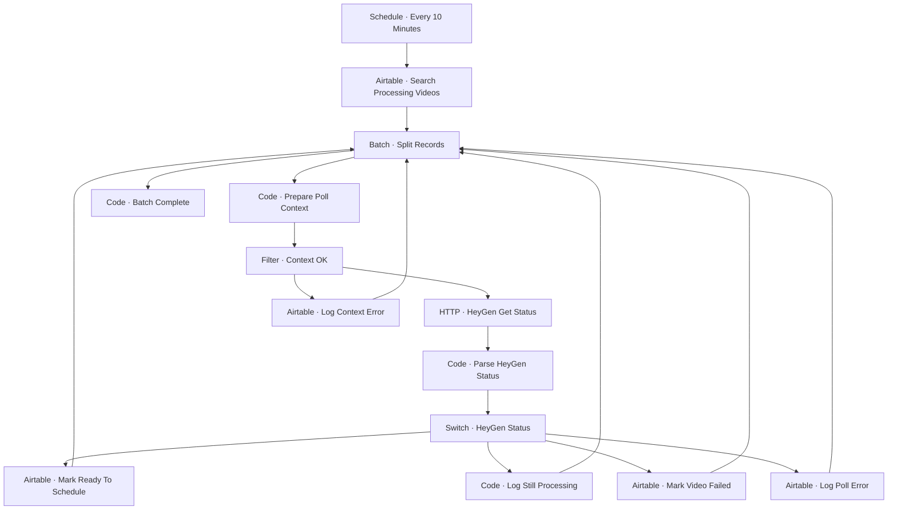

# Workflow Diagram — GHX-17-HeyGen-Status-Poller

**Source:** `GHX-17-HeyGen-Status-Poller.json` · **Status:** Functional Build · **Complexity:** Intermediate  
**Execution evidence:** Not found — definition only.

