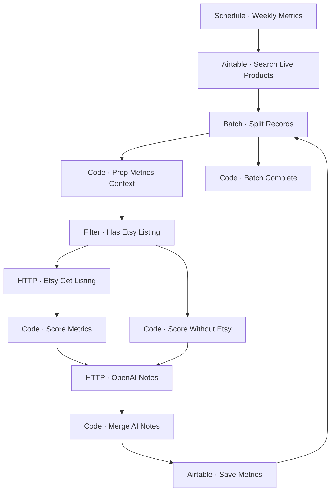

# Workflow Diagram — GHX-10-Performance-Tracker

**Source:** `GHX-10-Performance-Tracker.json` · **Status:** Functional Build · **Complexity:** Advanced  
**Execution evidence:** Not found — definition only.

