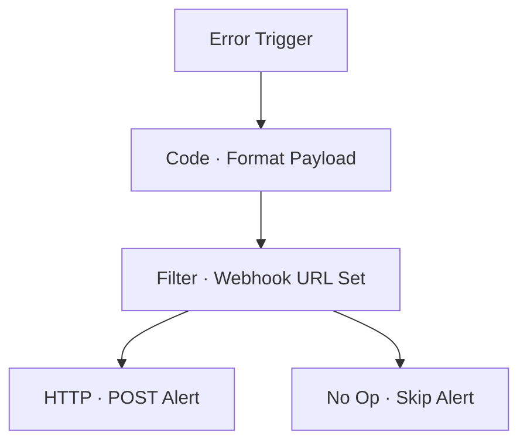

# Workflow Diagram — GHX-00-Error-Alerts

**Source:** `GHX-00-Error-Alerts.json` · **Status:** Functional Build · **Complexity:** Beginner  
**Execution evidence:** Not found — definition only.

```mermaid
flowchart TD
  Error_Trigger["Error Trigger"]
  Code___Format_Payload["Code · Format Payload"]
  Filter___Webhook_URL_Set["Filter · Webhook URL Set"]
  HTTP___POST_Alert["HTTP · POST Alert"]
  No_Op___Skip_Alert["No Op · Skip Alert"]
  Error_Trigger --> Code___Format_Payload
  Code___Format_Payload --> Filter___Webhook_URL_Set
  Filter___Webhook_URL_Set --> HTTP___POST_Alert
  Filter___Webhook_URL_Set --> No_Op___Skip_Alert
```
