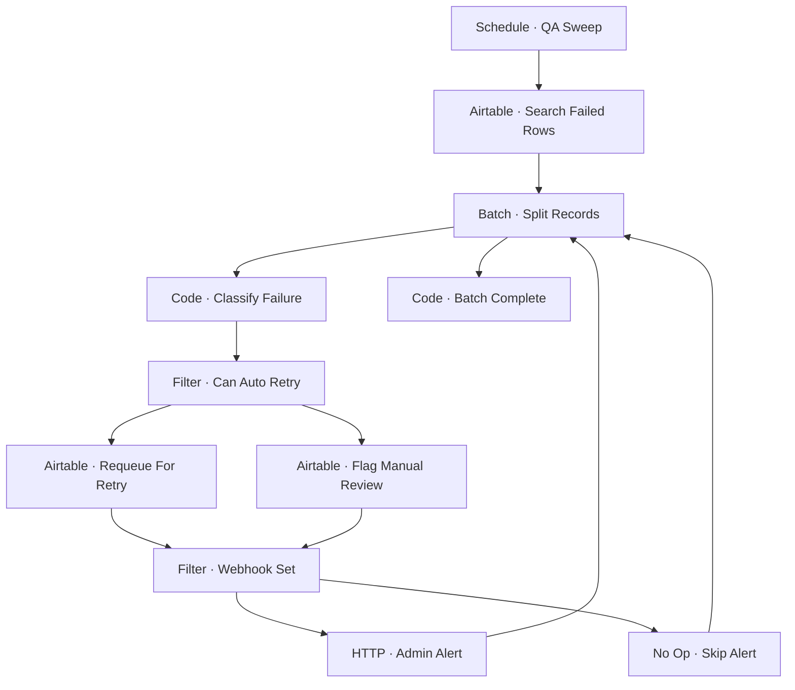

# Workflow Diagram — GHX-09-Self-Healing-QA

**Source:** `GHX-09-Self-Healing-QA.json` · **Status:** Functional Build · **Complexity:** Intermediate  
**Execution evidence:** Not found — definition only.

